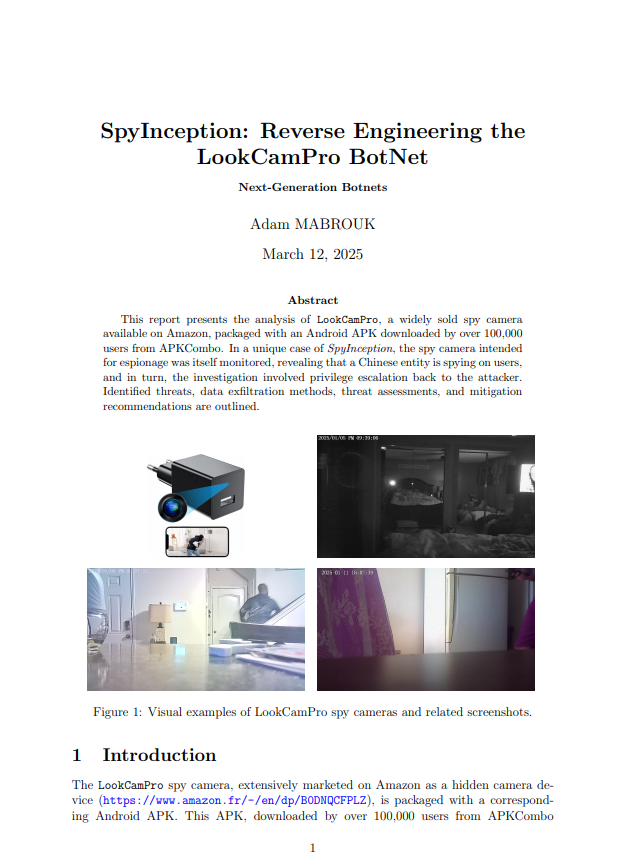

# IoT Spyware Reverse Engineering Project



## Overview

This project involves reverse engineering a spycam application to understand its functionality, analyze its security implications, and identify potential privacy risks. The analysis includes static and dynamic analysis of the APK, examining the AndroidManifest.xml file, and identifying sensitive permissions and components.

## Article Preview

[SpyInception Article](article.pdf)

In this article, we delve into the process of reverse engineering the spycam application "LookCamPro". We explore the steps taken to extract the APK, perform static analysis using tools like Jadx-Gui, and analyze the AndroidManifest.xml file for potential security and privacy concerns. The article highlights key findings, including sensitive permissions, excessive background services, and potential privacy risks associated with the application.

## Technical Process

### 1. Setup and Installation

- Enable developer mode on the phone and install adb.
- Launch adb devices (with sudo first time) and validate the public RSA key from the phone side.

### 2. Extracting the APK and Performing Static Analysis

- List packages and grep for the keyword that isolates the app:
  ```sh
  $ adb shell pm list packages | grep lookcam
  ```
  This is the concerned package we're looking for:
  ```
  package:com.shix.lookcam
  ```

- Identify the APK path for the package:
  ```sh
  adb shell pm path com.shix.lookcam
  ```
  Example location on the phone:
  ```
  /data/app/~~7xU8sC15t0F_ic-GGKFzHg==/com.shix.lookcam-N0VHORpkIPHMiCzq13pHNA==/base.apk
  ```

### 3. Test Setup

#### 3.1 Phone Platform

- Using a Samsung Galaxy S10 emulated on Genymotion, Android version 11.
- Flash a zip for ARM compatibility on x86_64 architectures.
  [Genymotion A11 libhoudini](https://github.com/niizam/Genymotion_A11_libhoudini)

#### 3.2 APK - Test Run

- Download page: [LookCamPro APK](https://apkpure.com/fr/lookcampro/com.shix.lookcam)

#### 3.3 Host Machine

- Ensure the host machine is set up for analysis.

### 4. Threat Analysis

#### 4.1 Static Analysis of the APK

- Use Jadx-Gui to analyze the static code of the APK.
- Install JRE/JDK:
  ```sh
  $ sudo apt install default-jre
  $ sudo apt install default-jdk
  ```
- Download and unzip Jadx release:
  [Jadx GitHub](https://github.com/skylot/jadx)

- Analyze the AndroidManifest.xml file for sensitive permissions and components.

## Key Findings

### 1. Permissions

- **Sensitive Permissions**: READ_EXTERNAL_STORAGE, WRITE_EXTERNAL_STORAGE, RECORD_AUDIO, CAMERA, etc.
- **Excessive Permissions**: Permissions unrelated to the app's stated purpose.

### 2. Services and Receivers

- **Push Services**: Integration with multiple push services (Xiaomi, Huawei, Vivo, Firebase).
- **Receivers**: Persistent communication with external servers.

### 3. Components and Intent-Filters

- **Exported Components**: Exposed functionality to other apps or attackers.
- **Intent-Filters**: Handling of URLs, potential for malicious redirection.

### 4. Additional Concerns

- **Overuse of Push and Background Services**: Facilitates malicious operations.
- **Privacy Risks**: Sensitive permissions with internet access pose severe risks.
- **Obfuscated Metadata**: Potentially hiding malicious configurations.
- **Legacy and Deprecated Permissions**: Attempts to bypass modern security constraints.

## Recommendations

### Static Analysis

- Review the codebase for suspicious network calls, hardcoded credentials, encryption keys, or URLs.

### Dynamic Analysis

- Test the app in a controlled environment and monitor network traffic for unusual behavior.

### Permission Audit

- Remove excessive permissions and test the app’s functionality.

### Cross-Reference

- Compare findings with known malware or spyware patterns.

## Conclusion

The app exhibits multiple characteristics of a potentially malicious tool. Sensitive permissions, exported components, and excessive background services strongly suggest a high risk of misuse or abuse. Further analysis in a secure, isolated environment is recommended.
